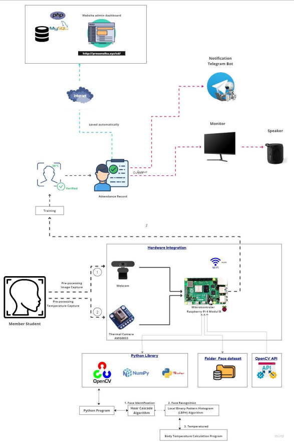

# Sistem Deteksi Wajah dan Suhu Untuk Presensi dan Pengecekan Suhu Tubuh Berbasis IoT

  

Sistem Deteksi Wajah dan Suhu untuk Presensi dan Pengecekan Suhu Tubuh Berbasis IoT adalah sebuah alat yang menggabungkan teknologi _Internet of Things_ (IoT) dengan deteksi wajah dan pengukuran suhu tubuh. Alat ini menggunakan _hardware_ seperti _webcam_ untuk mendeteksi wajah dan sensor suhu AMG8833 untuk mengukur suhu tubuh. Raspberry Pi 4 Model B berperan sebagai mikrokontroller utama yang menjalankan sistem, dengan sistem operasi Raspbian sebagai platformnya.

Dalam melakukan deteksi wajah, alat ini memanfaatkan algoritma _Local Binary Pattern Histogram_ dan _Haar Cascade Classifier_, serta didukung oleh antarmuka grafis (GUI) yang intuitif. Pengguna dapat mengeluarkan perintah deteksi wajah dan mengambil sampel wajah dengan mudah melalui GUI ini.

Alat ini juga memiliki kemampuan untuk mencocokkan wajah yang terdeteksi dengan data wajah yang sudah ada dalam _database_. Selain itu, sistem ini memiliki fitur penting, yaitu jika suhu tubuh pengguna lebih dari 38 derajat Celsius, presensi tidak akan berhasil, yang merupakan langkah proaktif dalam menjaga kesehatan pengguna.

Data presensi yang berhasil dikumpulkan akan dikirimkan ke sebuah _website_ yang telah di-_hosting_. Pengguna dapat dengan mudah mengunduh hasil rekapan presensi dalam format file Excel melalui _website hosting_. Selain itu, notifikasi presensi juga akan otomatis dikirimkan ke telegram pengguna melalui bot Telegram.

Sistem ini berhasil mengintegrasikan semua komponen, termasuk _website hosting_, _database server online_, dan bot Telegram. Data presensi akan tersimpan dengan aman pada _database server online_ dan dapat diakses melalui _website hosting_ dan melalui bot Telegram.

Selama proses pengembangan, sampel wajah sebanyak 25 foto untuk satu individu disimpan dalam _database_ sebagai bahan referensi untuk pencocokkan wajah saat algoritma deteksi wajah berjalan.

Alat ini juga memanfaatkan berbagai teknologi dan perangkat lunak, termasuk Python dengan _library_ seperti OpenCV, Tkinter, dan NumPy untuk implementasi deteksi wajah dan antarmuka pengguna.

Penyimpanan data menggunakan _database_ PHPMyAdmin MySQL yang di-_hosting_ pada _server online_ yang disediakan oleh layanan _hosting_ yang digunakan. Pembuatan _Website_ menggunakan bahasa pemrograman PHP dengan dukungan dari _framework_ Laravel dan Bootstrap untuk memastikan antarmuka web yang responsif dan ramah pengguna.

Sistem Deteksi Wajah dan Suhu ini menggabungkan teknologi canggih untuk memberikan solusi presensi yang efisien, aman, dan proaktif dalam menjaga kesehatan pengguna.

## Flowchart Sistem

  

    <b>Gambar 1</b> Flowchart Sistem

Pada Gambar 2, merupakan gambaran umum yang diperoleh meliputi blok diagram. Terdiri dari beberapa komponen yang digunakan pada alat yang akan dirancang, sehingga komponen satu dengan lainnya terhubung, menjadikan sebuah _prototype_. Sistem yang akan dibuat memiliki beberapa komponen yang harus disediakan diantaranya sensor AMG8833 dan _webcam_ sebagai _input_. Raspberry Pi 4 Model B sebagai mikrokontroler yang 
terhubung pada monitor sebagai tempat melakukan pemrograman data, terhubung pada catu 
daya. _Speaker_ dan tampilan data pada monitor dijadikan _output_ hasil data. 
_Speaker_ memberikan suara peringatan ketika suhu tidak normal. Bot telegram dan juga 
_website admin dashboard_ ( http://presensiku.xyz/cd ) digunakan sebagai wadah untuk 
menampilkan data hasil presensi. Bot Telegram berupa notifikasi yang menampilkan data 
nama dan waktu, _Website_ sebagai wadah agar pengguna bisa mengakses beberapa fitur 
terutama untuk mengunduh rekapan data hasil presensi yang berupa file excel.
Sistem pendeteksian wajah ini diprogram menggunakan Bahasa Python, dibantu dengan 
beberapa _library_ diantaranya OpenCV, NumPy, Tkinter, dll. Program ini juga mengaplikasikan 
beberapa algoritma diantaranya _Haar Cascade Algorithm_ dan _Local Binary Pattern Histogram_
(LBPH) Algorithm.

  

    <b>Gambar 2</b> Desain Perangkat Keras

